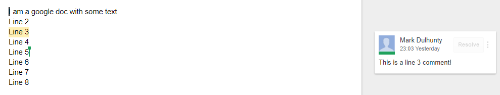
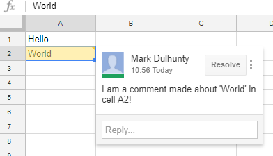

## googledrive-comment
The following examples show how comments can be retrieved from google docs or google sheets using the [googledrive](http://googledrive.tidyverse.org) package and are based specifically on the details about [making a request](http://googledrive.tidyverse.org/reference/make_request.html).  

### Retrieve google document comments
The following example assumes a google doc named `foo_doc` exists in My Drive and has some comments. For example:  

***

***

The comments can be extracted from the doc using the following code:
```r
library(googledrive)

x <- drive_get("foo_doc")
req <- build_request(
  path = paste0("drive/v3/files/", x$id ,"/comments"),
  method = "GET",
  params = list(
    fileId = x$id,
    fields = "*"
  ),
  token = googledrive:::drive_token()
)

cmt <- process_response(make_request(req))
```
The returned object is quite detailed.  For the sample document, some of the more immediately relevant information can be accessed like this: 
```r
cmt$comments[[1]]$content
#> [1] "This is a line 3 comment!"

cmt$comments[[1]]$quotedFileContent
#> $mimeType
#> [1] "text/html"
#> 
#> $value
#> [1] "Line 3"
```

## Retrieve google sheets comments
The same approach also works for google sheets.  Assume you have a google sheet named `foo_sheet` in My Drive.

***

***

Just replace `foo_doc` with `foo_sheet` to obtain the following comment details:

```r
cmt$comments[[1]]$content
#> [1] "I am a comment made about 'World' in cell A2!"
cmt$comments[[1]]$quotedFileContent
#> $mimeType
#> [1] "text/html"
#> 
#> $value
#> [1] "World"
```

The examples only show a couple of returned comment properties as an illustration.  Details of properties returned can be found in the [Google Drive API documentation on comments](https://developers.google.com/drive/v3/reference/comments#resource).
